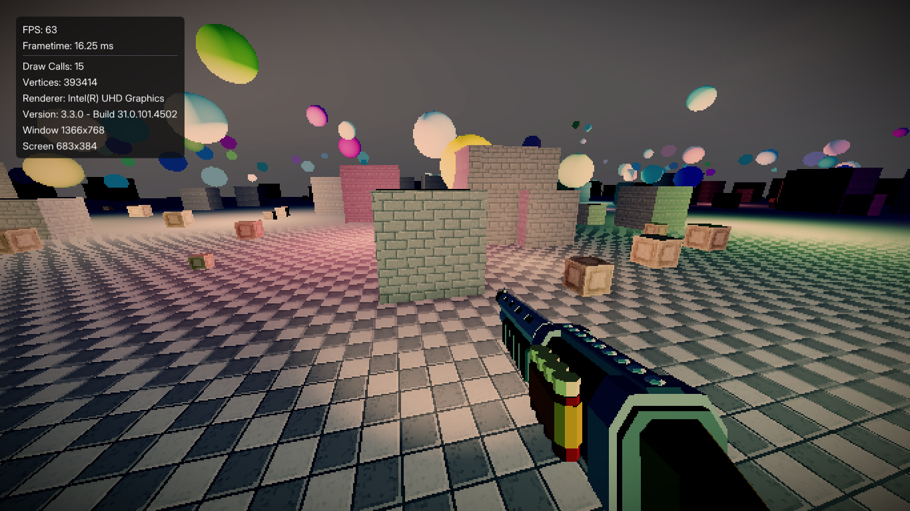

# OpenGameKit 🎮

Минималистичный игровой движок на C++23 с OpenGL 3.3 Core Profile, созданный для разработки личных проектов и игр.



## ✨ Особенности

- **Современный C++23** — использование последних возможностей языка
- **OpenGL 3.3 Core** — кроссплатформенная графика через GLFW + GLAD
- **Модульная архитектура** — чистые обёртки вокруг OpenGL объектов
- **State-based система** — управление состояниями игры (меню, геймплей, пауза)

## 🚀 Быстрый старт

### Требования

- Компилятор с поддержкой C++23 (GCC 13+, Clang 16+, MSVC 2022+)
- OpenGL 3.3+ драйверы

### Зависимости

- [GLFW](https://www.glfw.org/) — управление окнами и вводом
- [GLAD](https://glad.dav1d.de/) — загрузчик OpenGL функций
- [GLM](https://github.com/g-truc/glm) — математическая библиотека
- [stb_image](https://github.com/nothings/stb) — загрузка изображений

### Пример использования

```cpp
#include "engine.hpp"
#include "window.hpp"
#include "log.hpp"

class GameState : public IEngineState {
public:
    void OnEnter() noexcept override {
        log(LogLevel::Success, "Game started!");
    }

    void Update() noexcept override {
        if (Input::GetKeyPressed(GLFW_KEY_ESCAPE)) {
            Window::ToggleMouseGrab();
        }
    }

    void Render() noexcept override {
        auto size = Window::Size();
        glViewport(0, 0, size.x, size.y);
        glClear(GL_COLOR_BUFFER_BIT | GL_DEPTH_BUFFER_BIT);

        // Ваша отрисовка здесь
    }
};

int main() {
    Config conf{.WinSize = {1920, 1080}};
    
    if (!Engine::Create(&conf)) {
      std::println("Failed to create engine");
      std::terminate();
    };

    std::unique_ptr<IEngineState> state(new GameState);
    Engine::SetState(state);
    Engine::Run();
    Engine::Destroy();

    return 0;
}
```

## 🎯 Ключевые компоненты

### Engine & States

Движок использует паттерн State Machine для управления различными режимами работы:

```cpp
class MenuState : public IEngineState { /* ... */ };
class PlayState : public IEngineState { /* ... */ };

Engine::SetState(menuState);  // Переключение между состояниями
```

Каждое состояние имеет методы:

- `OnEnter()` — инициализация при входе
- `Update()` — обновление каждый кадр
- `FixedUpdate30/60()` — фиксированные апдейты для физики
- `Render()` — отрисовка
- `OnExit()` — очистка при выходе

### Graphics

**Buffer** — умная обёртка над OpenGL буферами:

```cpp
Buffer vbo(GL_ARRAY_BUFFER);
vbo.Allocate(size, GL_STATIC_DRAW, data);
vbo.Set(offset, size, newData);  // Частичное обновление
```

**VertexArray** — управление VAO с автоматическим биндингом:

```cpp
VertexArray vao;
vao.SetAttribute(vbo, {
    {.Location=0, .Comps=3, .Type=GL_FLOAT, .Stride=sizeof(Vertex)}
});
vao.AttachIndexBuffer(ebo);
```

**Image2D** — работа с пиксельными данными:

```cpp
Image2D img;
img.FromFile("texture.png");  // Автоматический flip Y
img.WriteFile("output.png");
```

### Input System

Единый интерфейс для всех типов ввода:

```cpp
// Клавиатура
if (Input::GetKeyPressed(GLFW_KEY_W)) { /* Нажата W */ }
if (Input::GetKeyDown(GLFW_KEY_SPACE)) { /* Удерживается пробел */ }

// Мышь
double dx, dy;
Input::GetCursorDelta(dx, dy);  // Дельта движения мыши

// Скролл
double scrollX, scrollY;
Input::GetMouseScroll(scrollX, scrollY);
```

### Timing & Performance

```cpp
Clock::SetFPSCap(60);           // Ограничение FPS
float dt = Clock::DeltaTime();  // Delta time для плавного движения
uint fps = Clock::FPS();        // Текущий FPS
```

---

**Создано с ❤️ на C++23**
